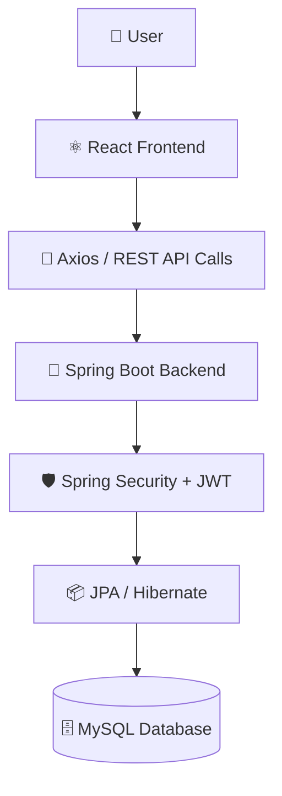
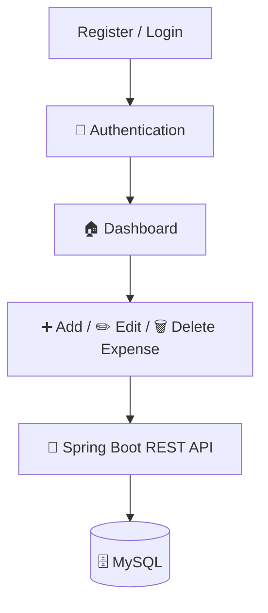
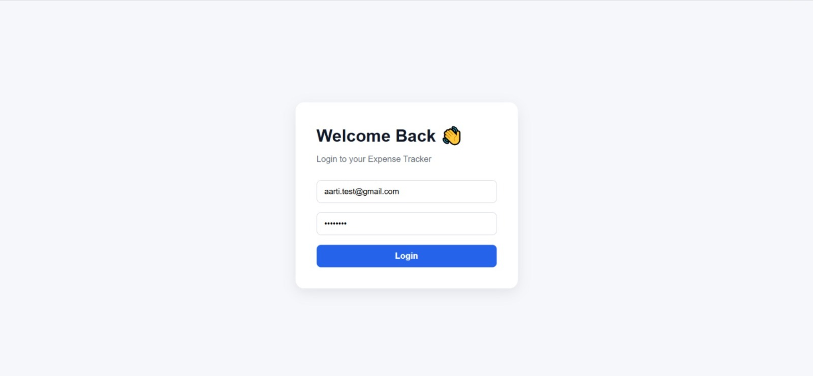
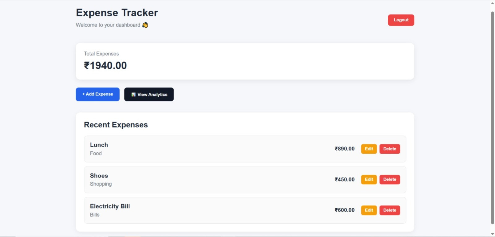
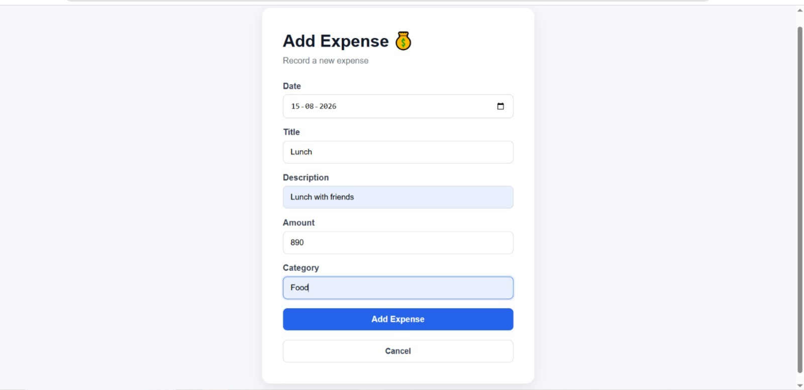
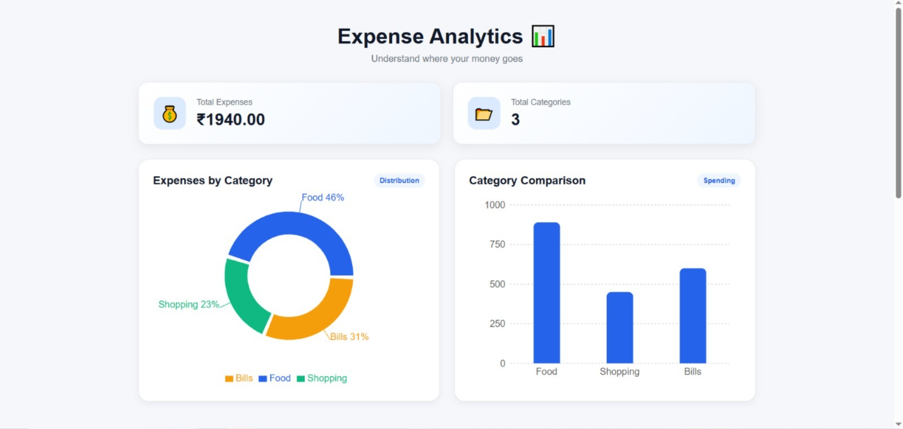
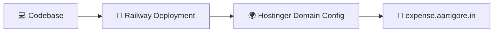

<div align="center">

# 💰 Expense Tracker

### Track • Manage • Analyze Your Expenses

A secure, full-stack expense management application built with **Spring Boot** and **React**, featuring JWT-based authentication, a protected dashboard, and real-time expense tracking — deployed live for production use.

[](https://www.java.com)
[](https://spring.io/projects/spring-boot)
[](https://react.dev)
[](https://www.mysql.com)
[](https://spring.io/projects/spring-security)
[](https://jwt.io)
[](https://railway.app)
[](https://github.com/Aartigore14/expense-tracker-fullstack)

[🌐 Live Demo](https://expense.aartigore.in) · [📂 Repository](https://github.com/Aartigore14/expense-tracker-fullstack)

</div>

<br>

---

## 💰 About The Project

**Expense Tracker** is a full-stack web application that enables users to securely register, authenticate, and manage their personal expenses through a clean, responsive dashboard. Built with a **Spring Boot REST API** backend and a **React** frontend, the application implements industry-standard practices for authentication (JWT), authorization (Spring Security), and data persistence (Spring Data JPA + MySQL).

The application is deployed to production and accessible via a custom domain, demonstrating an end-to-end development lifecycle — from backend architecture and secure API design to frontend integration and deployment.

<br>

---

## ✨ Features

<div align="center">

| Category | Features |
|---|---|
| 🔐 **Authentication** | User Registration • User Login • JWT Authentication • Logout |
| 🏠 **Dashboard** | Protected Dashboard Access |
| 💸 **Expense Management** | Add Expense • Edit Expense • Delete Expense • View Recent Expenses |
| 📊 **Insights** | Total Expense Calculation • Expense Analytics • Expense Categories |
| 📱 **Experience** | Responsive UI |
| 🌐 **Production** | Live Deployment • Custom Domain |

</div>

<br>

---

## 🛠️ Tech Stack

<div align="center">

### 💻 Languages


### ⚛️ Frontend


### ⚙️ Backend


### 🗄️ Database


### 🔧 Tools


</div>

<br>

---

## 🏗️ Architecture



<br>

---

## 🔄 Application Flow



<br>

---

## 🌐 Live Demo

<div align="center">

### The application is live and accessible in production

[](https://expense.aartigore.in)

**🔗 https://expense.aartigore.in**

</div>

<br>

---
## 📸 Screenshots

<div align="center">

| Login | Dashboard |
|---|---|
|  |  |

| Add Expense | Analytics |
|---|---|
|  |  |

</div>

## ☁️ Deployment

The application is fully deployed for production access:

- 🚂 **Backend** — deployed using **Railway**
- 🌍 **Custom Domain** — configured through **Hostinger**
- 🔗 **Production URL** — accessible via [expense.aartigore.in](https://expense.aartigore.in)



<br>

---

## ⚙️ Installation & Setup

### Prerequisites
- Java 17+
- Node.js & npm
- MySQL Server
- Maven

### 1️⃣ Clone the Repository
```bash
git clone https://github.com/Aartigore14/expense-tracker-fullstack.git
cd expense-tracker-fullstack
```

### 2️⃣ Backend Configuration
Navigate to the backend directory and configure `application.properties`:
```properties
spring.datasource.url=jdbc:mysql://localhost:3306/expense_tracker_db
spring.datasource.username=your_mysql_username
spring.datasource.password=your_mysql_password

jwt.secret=your_jwt_secret_key
jwt.expiration=your_token_expiration_time
```

### 3️⃣ MySQL Setup
```sql
CREATE DATABASE expense_tracker_db;
```

### 4️⃣ Run the Spring Boot Backend
```bash
cd backend
mvn spring-boot:run
```

### 5️⃣ Install Frontend Dependencies
```bash
cd frontend
npm install
```

### 6️⃣ Configure Frontend Environment Variables
Create a `.env` file in the frontend root:
```env
VITE_API_BASE_URL=http://localhost:8080
```

### 7️⃣ Start the React Frontend
```bash
npm run dev
```

> ⚠️ Never commit real credentials or secrets. Use environment variables and `.gitignore` for sensitive configuration files.

<br>

---

## 🔐 Security

- 🔑 **JWT Authentication** — stateless, token-based user authentication
- 🛡️ **Protected Routes** — both frontend and backend routes are secured
- 👤 **User-Specific Data** — each user can only access their own expense records
- 🔒 **Secure Password Handling** — passwords are securely encoded, never stored in plain text
- 🌐 **CORS Configuration** — configured to allow secure cross-origin communication between frontend and backend

<br>

---

## 🧪 Testing

The application has been functionally tested across the following areas:

- ✅ User Registration
- ✅ User Login
- ✅ Invalid Login Handling
- ✅ Add Expense
- ✅ Edit Expense
- ✅ Delete Expense
- ✅ Logout
- ✅ Protected Route Access
- ✅ API Communication (Frontend ↔ Backend)
- ✅ Production Deployment Verification

<br>

---

## 🎓 Learning Outcomes

<div align="center">

`Java` `Spring Boot` `Spring Security` `JWT` `REST APIs` `React` `MySQL` `JPA/Hibernate` `Git/GitHub` `Postman` `CORS` `Deployment` `Custom Domain/DNS`

</div>

This project demonstrates the ability to design and ship a complete, production-ready full-stack application — from secure backend architecture and RESTful API design to frontend integration, deployment, and domain configuration.

<br>

---

## 👩‍💻 Developer

<div align="center">

### Aarti Gore
**Full Stack Java Developer**

`Java` · `Spring Boot` · `React` · `MySQL`

</div>

<br>

---

## ⭐ Support

If you found this project interesting or useful, consider giving it a **star** ⭐ — it helps and motivates further development!

<div align="center">

**Made with dedication by Aarti Gore**

</div>
